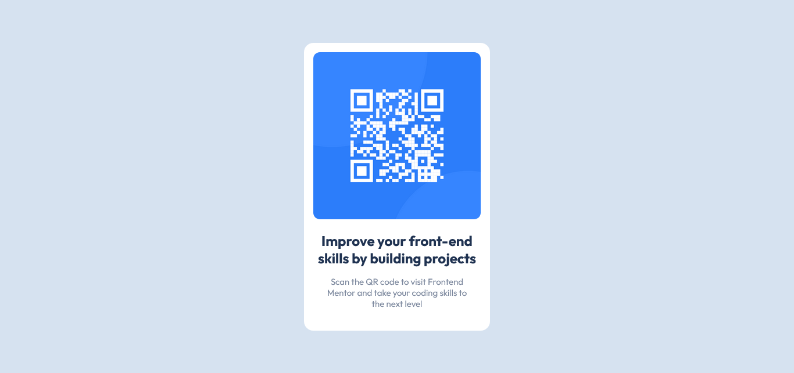

# Frontend Mentor - QR code component solution

This is a solution to the [QR code component challenge on Frontend Mentor](https://www.frontendmentor.io/challenges/qr-code-component-iux_sIO_H). Frontend Mentor challenges help you improve your coding skills by building realistic projects. 

## Table of contents

- [Overview](#overview)
  - [Screenshot](#screenshot)
  - [Links](#links)
- [My process](#my-process)
  - [Built with](#built-with)
  - [What I learned](#what-i-learned)
  - [Continued development](#continued-development)
- [Author](#author)

## Overview

### Screenshot



### Links

- Solution URL: [Solution](https://your-solution-url.com)
- Live Site URL: [Rhushabh-QR-Code-Component](https://rhushabh-qr-code-component.netlify.app/)

## My process

### Built with

- Semantic HTML5 markup
- CSS custom properties
- Flexbox
- [CSS Reset](https://piccalil.li/blog/a-modern-css-reset/) - CSS Reset

### What I learned

1. This project was simple enough for a beginner to complete, and I enjoyed the creative process. 
2. I practised CSS flexbox and used unique CSS variables and properties.

Code snippets:

```html
<h1>Some HTML code I'm proud of</h1>
```
```css
.proud-of-this-css {
    display: flex;
}
```

### Continued development

1. Using CSS Flexbox, this project was created. 
2. For clearer understanding, I also wanted to try developing this project using CSS grids.
3. In order to use CSS grids and variables more effectively in future projects, I would like to improve my understanding of them.

## Author
- Frontend Mentor - [@RhushabhPradhan](https://www.frontendmentor.io/profile/RhushabhPradhan)
- Twitter - [@RhushabhPradhan](https://www.twitter.com/RhushabhPradhan)

